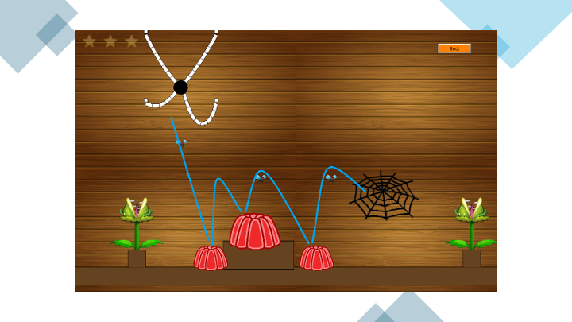

# Itsy Bitsy Terry

Itsy Bitsy Terry is a fun and entertaining game for all ages – both for the little ones and the grown-ups! Help Terry cut his spider threads so he can return to his beloved spider web! But watch out for the evil plants – they are trying to eat Terry! Along the way, there are some objects that could help you. Use them wisely!

## How to Play

- Hold down the left mouse button to activate the cutter. Keep holding it and move the mouse to change the cutter’s position. If the cutter touches a spider thread, it will be cut at that exact spot. Release the left mouse button to deactivate the cutter.
- When using portals, the threads must not be completely detached from Terry. He needs them as provisions for the "long" portal journey. Cut the threads so that pieces of each thread remain attached to Terry.
- When using trampolines, Terry can only jump high if all thread pieces have been cut off. Otherwise, he is too heavy. Cut the threads so that no thread pieces remain attached to Terry.

## Features

- Realistic physics and gravity simulationn
- Diverse and exciting levels
- Achievement saving
- Entertaining music and sound effects
- Fun game elements (spider threads, plants, portals, trampolines)

## Additional Information

The game was developed using the QT framework and utilizes the Box2D 2D physics engine to simulate physical interactions.

## Contributors

This game was created as part of a project for the lecture "C++ Programming" at the Chair of Data Processing by Anastasiia Kolesnyk, Chieh Lin, Laura Janssen, Alexander Aasmann, and Conrad Dang.

## Last Updates

The last changes were made on August 7, 2020.